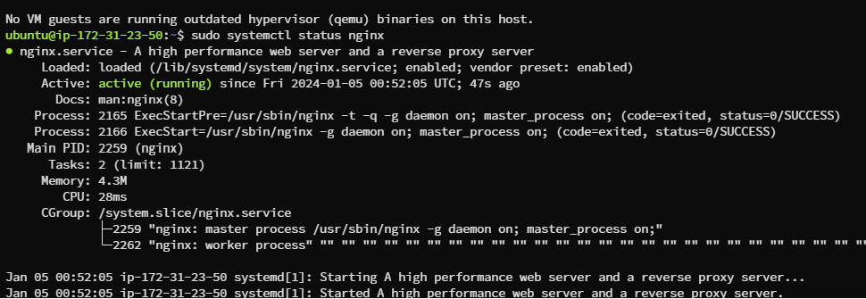
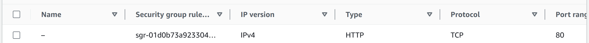
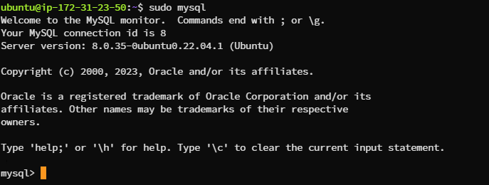

"# LEMP-STACK" 
Implementing a LEMP stack involves setting up a group of open-source software to serve web content. LEMP stands for Linux, Nginx (pronounced Engine-X), MySQL, and PHP. Here is a guide that you can follow to set up a LEMP stack:

In order to complete this project you will need an AWS account and a virtual server with Ubuntu Server OS.
If you do not have an AWS account - go back to Project 1 Step 0 to sign in to AWS free tier account and create a new EC2 Instance of t2.micro family with Ubuntu Server 22.04 LTS (HVM) image. Remember, you can have multiple EC2 instances, but make sure you STOP the ones you are not working with at the moment to save available free hours.

##  Step 1 – Installing the Nginx Web Server
In order to display web pages to our site visitors, we are going to employ Nginx, a high-performance web server. We’ll use the apt package manager to install this package.

Since this is our first time using apt for this session, start off by updating your server’s package index. Following that, you can use apt install to get Nginx installed:
```bash
sudo apt update
sudo apt install nginx -y
```

Once the installation is finished, the Nginx web server will be active and running on your Ubuntu 20.04 server.
To verify that nginx was successfully installed and is running as a service in Ubuntu, run:

```bash
sudo systemctl status nginx
```


If it is green and running, then you did everything correctly

Before we can receive any traffic by our Web Server, we need to open TCP port 80 which is default port that web brousers use to access web pages in the Internet.
As we know, we have TCP port 22 open by default on our EC2 machine to access it via SSH, so we need to add a rule to EC2 configuration to open inbound connection through port 80:



Our server is running and we can access it locally and from the Internet (Source 0.0.0.0/0 means 'from any IP address').
First, let us try to check how we can access it locally in our Ubuntu shell, run:

```bash
$ curl http://localhost:80
or
$ curl http://127.0.0.1:80
```
These 2 commands above actually do pretty much the same - they use 'curl' command to request our Nginx  on port 80 (actually you can even try to not specify any port - it will work anyway). The difference is that: in the first case we try to access our server via DNS name and in the second one - by IP address (in this case IP address 127.0.0.1 corresponds to DNS name 'localhost' and the process of converting a DNS name to IP address is called "resolution"). We will touch DNS in further lectures and projects.
As an output you can see some strangely formatted test, do not worry, we just made sure that our Nginx web service responds to 'curl' command with some payload.

Now it is time for us to test how our Nginx server can respond to requests from the Internet.
Open a web browser of your choice and try to access following url

```bash
http://<Public-IP-Address>:80
```


Another way to retrieve the public IP is to run the command below

```bash
curl -s http://169.254.169.254/latest/meta-data/public-ipv4
```
Step 2 — Installing MySQL
Now that you have a web server up and running, you need to install a Database Management System (DBMS) to be able to store and manage data for your site in a relational database. MySQL is a popular  relational database management system used within PHP environments, so we will use it in our project.
Again, use 'apt' to acquire and install this software:

```bash
sudo apt install mysql-server
```

When prompted, confirm installation by typing Y, and then ENTER.
When the installation is finished, log in to the MySQL console by typing

```bash
sudo mysql
```

This will connect to the MySQL server as the administrative database user root, which is inferred by the use of sudo when running this command. You should see output like this:


